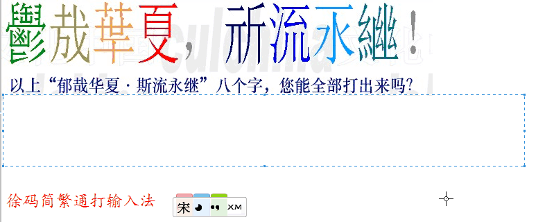

# 徐码简繁通打输入法

> [在线尝试徐码](http://www.xumax.top/webXuma/xumaSrf.html)

## 徐码输入法官方群
徐码输入法官方群①
- 218210590

需要下载徐码输入法的朋友，请到徐码官方群的群文件共享里下载。里面有最新，最全的，各平台上的徐码输入法可以使用。

1. **重码极低**
GB2312里,重码是160多对,而五笔是250对,在其他字集(GBK GB18030 超大字集)等等,重码都是最低的.
1. **拆分编码容易无识别码**
没有五笔的识别码和大字集的难拆分以及经常的拆分二义性,没有郑码的简全不一致,字词不一致 
1. **没有任何无理码及特殊拆分和编码**
如五笔里"里=日土",但实际上"里=甲二"是最符合五笔的拆分定义的,但是五笔没有采用. 五笔里"Q我"一级简码,但我的编码又是"我tfnt",像这样的一简里的无理码都有五六个以上 郑码里"D的"一级简码,也是典型的无理码. 无理码和奇异拆分,增加了使用者的学习难度,经常让初学者不知所然1. **高效** 二简字676,二简词676
1. **简繁通打**
目前26键四码形码里,徐码是唯一一个做到了简繁通打的输入法 简繁通打是,在不做任何"特殊键"切换的情况下,打简繁字,都不重码 如:銀银,軼轶,魯鲁,闷悶等等 郑码是部分做到简繁通打,五笔则是所有的简繁字都重码. 使用徐码,你可以做到真正的见字打字,重码极低.不再为打繁简字而烦恼 
1. **支持"明体字形"编码**
这一点对港台人特别重要. 我们知道"骗=马户冊",但是港台人的电脑里一般显示的是"骗=马戶冊",这不是汉字的问题,是汉字显示的问题.他们使用的是"明体字形",当他们使用形码输入法,就会出现问题.也许你会说,让他们改成"宋体"显示打字,不就行了吗?这样做是可以,但是,他们会感觉非常的别扭,就如同你打简出繁.感觉很不自然. 目前,也只有徐码做到了宋明两个标准字形的同时编码. 
1. **可以整句输入**
