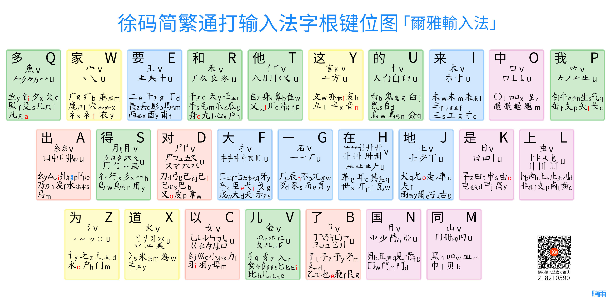

# 字根记忆
## 字根全键盘图

## 记忆方法

### ①记主根，副根的方法

主根：频率最最高的那二十几个偏旁+所有无读音字根副根：除了主根的。
故想区分主根，副根的最好方法就是记住那差不多26个主根，就可以了。记主根最好的方法是像形记忆 

### ②记小码的方法
频率最最就的那二十几个偏旁，小码为：V 所有无读音字根，小码为U
绝大部分副根，小码为副根的读音首字母。个别副根，小码是读音的第二字母（一般是yi->i的）
副根在一起的，一般都很有规律。一般记得前两笔主副根一致就可以了，且只要记得一个，其他类似的，看见，都可以猜出，它可能就是字根。如：日电早由禺甲曰（只要记得一个，日后看到类似的，很自然就可以回忆出，谁可能是字根）钅牛矢等等

### ③形变字根
由于在汉字的发展过程中，很多汉字本来写成”丿“的，后来改成写”丨“了，而这个是一个很普遍的现象。所以在字根的选取过程中，经常会出现”十，“这样的,字根基本相同，就是”丨丿“笔画的区别。

徐码里很多字根笔画里含有“丿丨”的，往往是同一个字根，如：“羊差(头)”,“干无(头)","亦变(头)","牛失(头)","月青(底)","半判(左)"等等 

### ④关于笔画
汉字的笔画是复杂多变了，徐码将汉字的笔画归类如下：

①G:横

②K:竖

③P:撇（撇点，也就是左点，如：忄的首笔画）

④W:捺（捺点，也就是右点，如：忄的末笔画）

⑤C，B:折（顺时针折，如：乛亅字母B，逆时针折，如：乚字母C）

